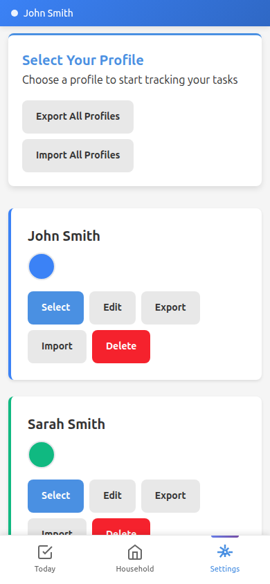
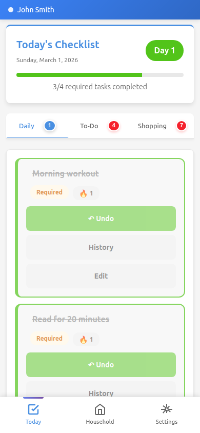
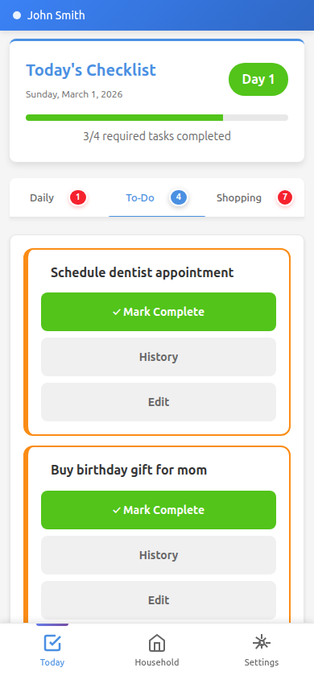
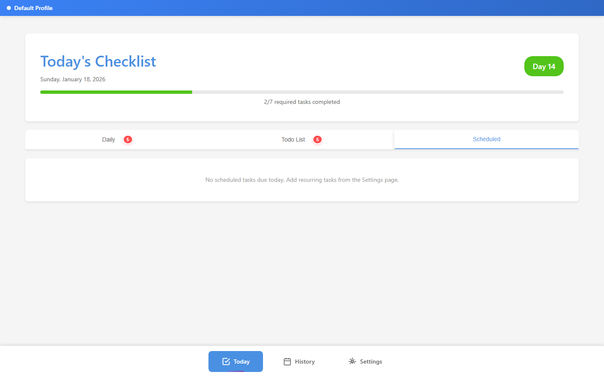
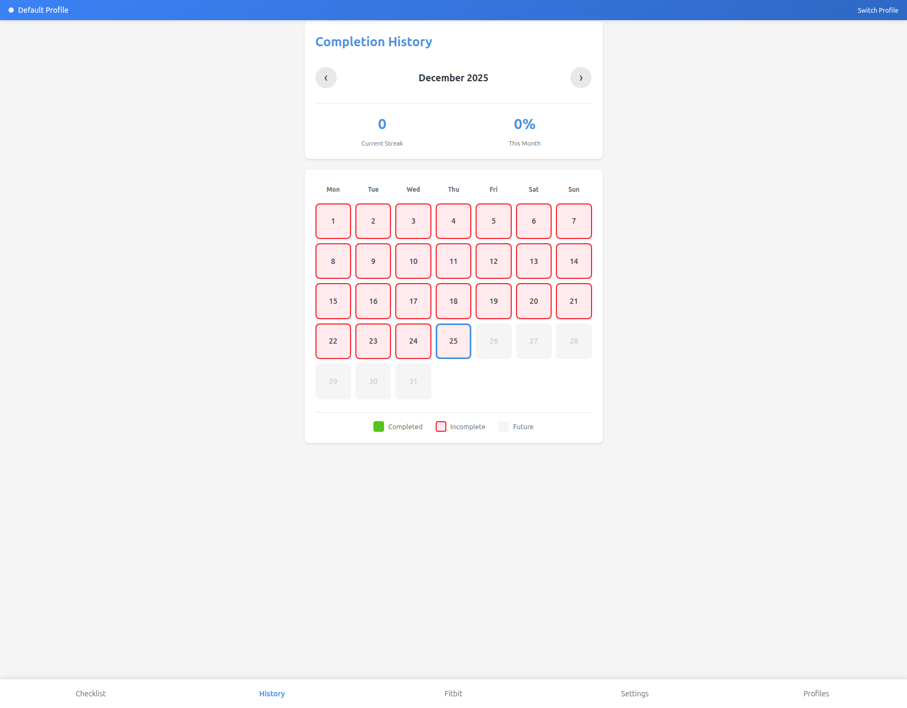
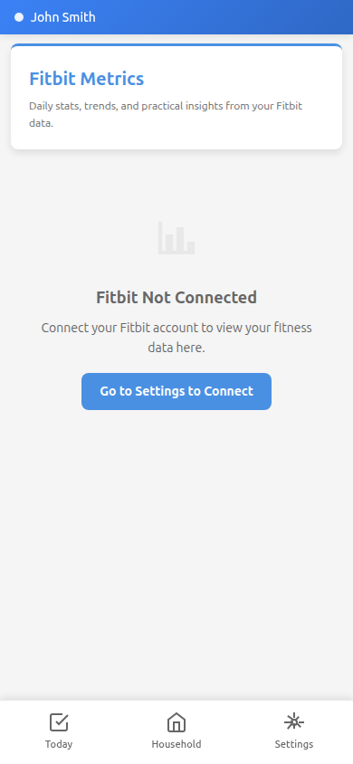
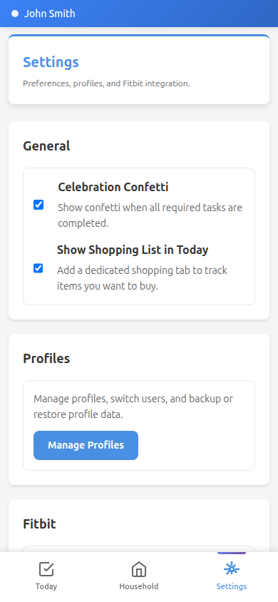

# Streaklet

A self-hosted, Dockerized daily streak tracker for maintaining consistent habits.

## Overview

Streaklet is a habit tracking application designed for families and personal use. It features multi-user profile support with completely isolated data, optional Fitbit integration for automatic task completion, and a mobile-first Progressive Web App experience.

## Key Features

- **Three Task Types** - Daily habits, one-off todos, and scheduled recurring tasks
- **Multi-User Profiles** - Support for multiple users with completely isolated data
- **Fitbit Integration** - Automatic task completion based on Fitbit metrics (steps, sleep, heart rate)
- **Progressive Web App (PWA)** - Install on mobile devices for native app-like experience
- **Offline Support** - Service worker caching for offline functionality
- **Mobile-First Design** - Optimized daily checklist interface with tabbed navigation
- **Automatic Streak Tracking** - Tracks consecutive completed days
- **Customizable Tasks** - Required/optional task flags
- **Timezone-Aware** - Accurate daily tracking across timezones
- **Calendar History** - Visual completion calendar with stats
- **Backup & Restore** - Export and import profile data
- **Persistent SQLite Database** - Simple, file-based storage
- **No Authentication Required** - Perfect for families on trusted networks

## Tech Stack

- **Backend**: Python 3.12, FastAPI, SQLAlchemy 2.0
- **Database**: SQLite with Alembic migrations
- **Frontend**: Jinja2 templates, Alpine.js, HTMX
- **Deployment**: Docker, Docker Compose
- **Testing**: pytest with coverage
- **CI/CD**: GitHub Actions with automated releases

## Quick Links

- [Installation Guide](getting-started/installation.md) - Get started with Docker
- [Task Types Guide](features/task-types.md) - Learn about daily, todo, and scheduled tasks
- [Fitbit Integration](features/fitbit.md) - Connect your Fitbit device
- [API Reference](api/endpoints.md) - REST API documentation
- [Contributing Guide](development/contributing.md) - Help improve Streaklet

## Screenshots

### Profiles

### Daily Checklist

### Todo List

### Scheduled Tasks

### History Calendar

### Fitbit Integration

### Task Settings

## License

MIT License - See [LICENSE](https://github.com/ptmetcalf/streaklet/blob/main/LICENSE)
